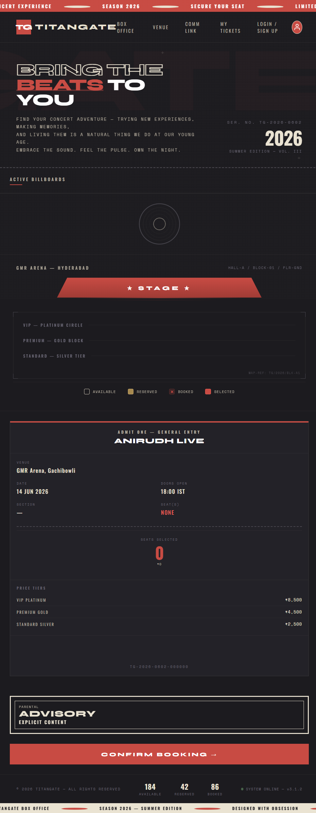
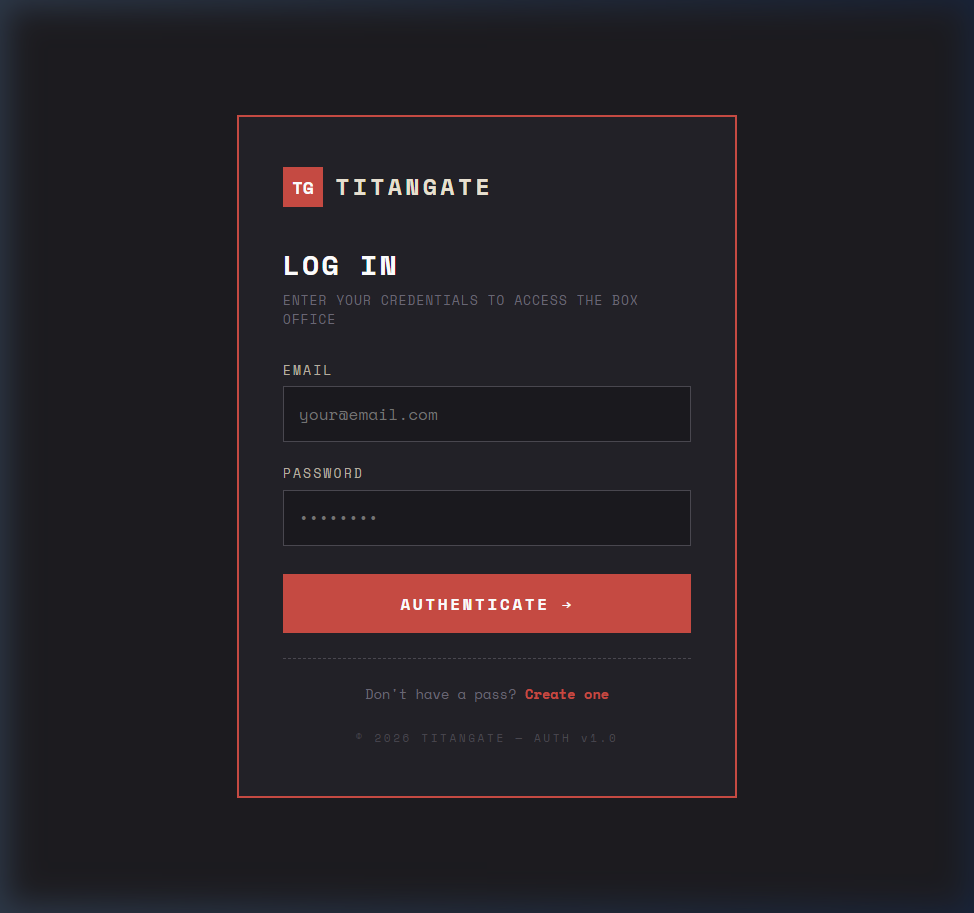
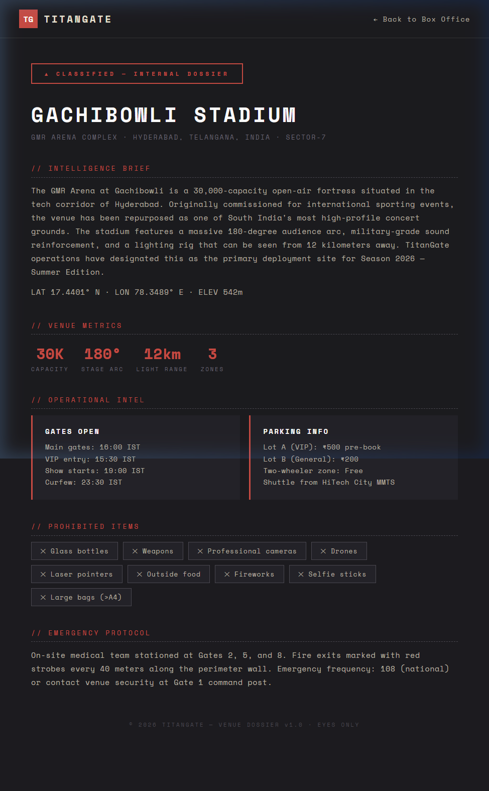

# 🎟️ TitanGate — Real-Time Live Event Booking System

> A high-performance, full-stack live event ticketing platform with a premium brutalist UI, real-time seat locking via Socket.io, Razorpay payment integration, and automated QR-code ticket delivery.


---

## 📸 Screenshots

<p align="center">
  
  <br/>
  <em>The Box Office — Interactive stadium seat map with real-time availability</em>
</p>

<p align="center">
  
  
</p>
<p align="center">
  <em>Login / Venue Dossier</em>
</p>

---

## 🚀 Features

### Core Booking Engine
- **Real-Time Seat Locking** — Socket.io broadcasts seat locks across all active users in milliseconds, preventing double-bookings
- **5-Minute Auto-Release** — Lazy-evaluation sweeps ensure seats are released if a user holds a reservation without paying
- **Atomic Seat Claims** — `findOneAndUpdate` with compound conditions ensures race-condition-proof seat locking

### Payments & Delivery
- **Razorpay Integration** — Full payment flow with cryptographic HMAC-SHA256 signature verification to prevent payment spoofing
- **QR Code Ticket Delivery** — Generates unique QR codes per ticket and emails them as embedded CID attachments via Brevo SMTP
- **Automated HTML Emails** — Beautiful branded confirmation emails sent instantly upon purchase via Nodemailer

### Security
- **JWT Authentication** — Stateless token-based auth with bcrypt password hashing
- **Helmet** — Secure HTTP headers (XSS protection, MIME sniffing prevention, etc.)
- **Rate Limiting** — Auth endpoints: 20 req/15min | Ticket endpoints: 30 req/min
- **Input Validation** — Express-validator middleware on all user-facing routes
- **Payload Limiting** — 10KB JSON body limit to block oversized payloads

### Admin Dashboard
- **Event Factory** — Create events and auto-generate 100+ stadium seats (VIP/Premium/Standard zones) in a single API call
- **Live Stats** — Real-time dashboard showing total revenue, seat availability breakdown, and event metrics

### Frontend
- **Zero-Dependency UI** — Pure HTML/CSS/JS with no frameworks — ultra-fast DOM manipulation
- **Dynamic CSS Stadium** — Renders hundreds of interactive seats using lightweight HTML/CSS instead of heavy SVGs
- **Brutalist Design** — Premium dark-mode aesthetic with Space Mono typography and crimson accent system
- **Paginated Ticket History** — Users can view their booking history with server-side pagination

---

## 🛠️ Tech Stack

| Layer | Technology |
|-------|-----------|
| **Frontend** | Vanilla HTML, CSS, JavaScript (zero dependencies) |
| **Backend** | Node.js, Express.js v5 |
| **Database** | MongoDB (Mongoose ODM) |
| **Real-Time** | Socket.io |
| **Payments** | Razorpay API |
| **Email** | Nodemailer + Brevo SMTP |
| **QR Codes** | `qrcode` (Base64-to-CID embedding) |
| **Security** | Helmet, express-rate-limit, JWT, bcryptjs |
| **Containerization** | Docker |

---

## 📂 Project Structure

```
TitanGate/
├── config/
│   └── db.js                  # MongoDB connection
├── controllers/
│   ├── adminController.js     # Admin stats & event factory
│   ├── authController.js      # Signup, login, JWT issuance
│   ├── eventController.js     # Event CRUD
│   └── ticketController.js    # Seat locking, booking, payments, QR, email
├── middlewares/
│   ├── errorHandler.js        # Global error handler
│   ├── validate.js            # Input validation middleware
│   └── verifyToken.js         # JWT authentication guard
├── models/
│   ├── EventModel.js          # Event schema (name, venue, date, capacity)
│   ├── TicketModel.js         # Ticket schema (seat, zone, status, lock timer)
│   └── UserModel.js           # User schema (name, email, hashed password)
├── public/
│   ├── index.html             # Main Box Office — stadium seat map
│   ├── login.html             # Authentication — login
│   ├── signup.html            # Authentication — registration
│   ├── venue.html             # Venue Dossier — event location details
│   ├── contact.html           # Comm Link — contact information
│   ├── profile.html           # User profile & ticket history
│   └── admin.html             # Admin dashboard
├── routes/
│   ├── adminRoutes.js         # /admin endpoints
│   ├── eventRoutes.js         # /events endpoints
│   ├── ticketRoutes.js        # /tickets endpoints
│   └── userRoutes.js          # /users endpoints
├── utils/
│   └── sendEmail.js           # Nodemailer email utility
├── screenshots/               # README screenshots
├── .env                       # Environment variables (not committed)
├── .gitignore
├── Dockerfile                 # Docker containerization
├── package.json
├── seedSeats.js               # Stadium seat seeder script
├── server.js                  # Express + Socket.io entry point
└── README.md
```

---

## ⚙️ Installation & Local Setup

### Prerequisites
- **Node.js** v20+
- **MongoDB** (Atlas or local)
- **Razorpay** test/live account
- **Brevo** (or any SMTP provider) for email

### 1. Clone the repository
```bash
git clone https://github.com/Saicharan-2109/TitanGate.git
cd TitanGate
```

### 2. Install dependencies
```bash
npm install
```

### 3. Configure environment variables
Create a `.env` file in the root directory:
```env
PORT=5000
MONGO_URI=your_mongodb_connection_string
JWT_SECRET=your_super_secret_jwt_key
JWT_EXPIRES_IN=30d

RAZORPAY_KEY_ID=your_razorpay_key
RAZORPAY_KEY_SECRET=your_razorpay_secret

BREVO_SMTP_SERVER=smtp-relay.brevo.com
BREVO_SMTP_LOGIN=your_brevo_login
BREVO_SMTP_PASSWORD=your_brevo_password
```

### 4. Seed the stadium (optional)
Generate hundreds of seats for your events:
```bash
node seedSeats.js
```

### 5. Start the server
```bash
node server.js
```
The app will be running at `http://localhost:5000`

---

## 🐳 Docker

```bash
# Build the image
docker build -t titangate .

# Run the container
docker run -p 5000:5000 --env-file .env titangate
```

---

## 🔌 API Endpoints

### Authentication
| Method | Endpoint | Description | Auth |
|--------|----------|-------------|------|
| `POST` | `/users/signup` | Register a new user | ❌ |
| `POST` | `/users/login` | Login & receive JWT | ❌ |
| `GET` | `/users/profile` | Get user profile | ✅ |

### Tickets
| Method | Endpoint | Description | Auth |
|--------|----------|-------------|------|
| `GET` | `/tickets` | Get all seats (with auto-cleanup) | ❌ |
| `POST` | `/tickets/lock` | Lock a seat for 5 minutes | ✅ |
| `POST` | `/tickets/cancel` | Release a locked seat | ✅ |
| `POST` | `/tickets/create-order` | Create Razorpay payment order | ✅ |
| `POST` | `/tickets/confirm` | Verify payment & confirm booking | ✅ |
| `GET` | `/tickets/my-tickets` | Get user's booked tickets (paginated) | ✅ |

### Events
| Method | Endpoint | Description | Auth |
|--------|----------|-------------|------|
| `GET` | `/events` | List all events | ❌ |

### Admin
| Method | Endpoint | Description | Auth |
|--------|----------|-------------|------|
| `GET` | `/admin/stats` | Dashboard stats & revenue | ✅ |
| `POST` | `/admin/create-event` | Create event + generate seats | ✅ |

---

## 🔒 Security Measures

- **Password Hashing** — bcryptjs with salt rounds
- **JWT Tokens** — Stateless authentication with 30-day expiry
- **Helmet** — 11+ security headers set automatically
- **Rate Limiting** — Per-route throttling to prevent brute force & abuse
- **HMAC Verification** — Razorpay signature verification prevents payment fraud
- **Payload Limits** — 10KB max JSON body size
- **CORS** — Configurable cross-origin resource sharing

---

## 📡 Real-Time Architecture

```
┌─────────────┐     Socket.io      ┌─────────────┐
│   User A    │◄──────────────────►│             │
│  (Browser)  │                    │   Express   │
└─────────────┘                    │   Server    │
                                   │             │
┌─────────────┐     Socket.io      │  + Socket   │
│   User B    │◄──────────────────►│    .io      │
│  (Browser)  │                    │             │
└─────────────┘                    └──────┬──────┘
                                          │
                                   ┌──────▼──────┐
                                   │  MongoDB    │
                                   │  (Atlas)    │
                                   └─────────────┘
```

When **User A** locks a seat → the server broadcasts a `seatUpdate` event → **User B** instantly sees the seat turn red. No page refresh needed.

---

## 👤 Author

**Sai Charan**
- GitHub: [@Saicharan-2109](https://github.com/Saicharan-2109)

---

## 📄 License

ISC

---

*Built with obsession.* 🔥
